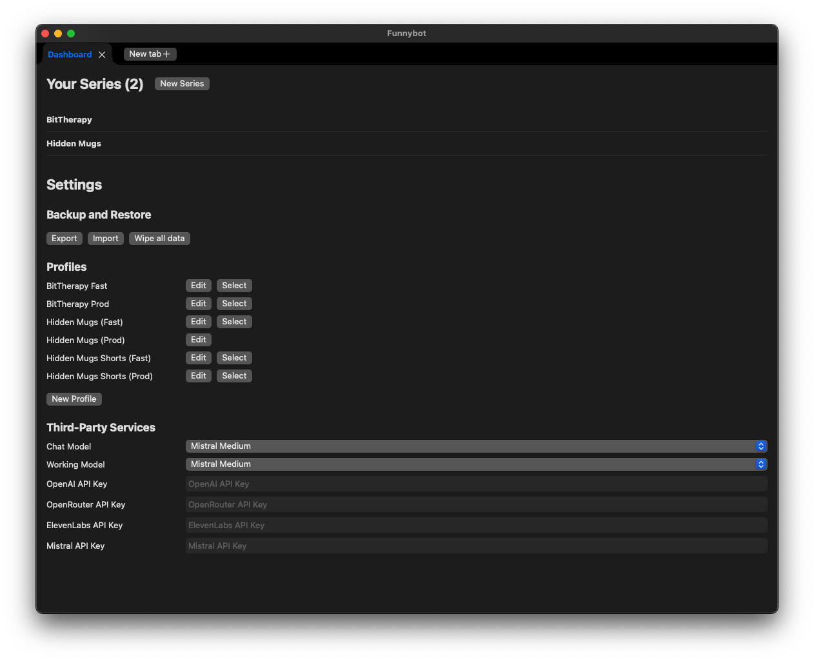
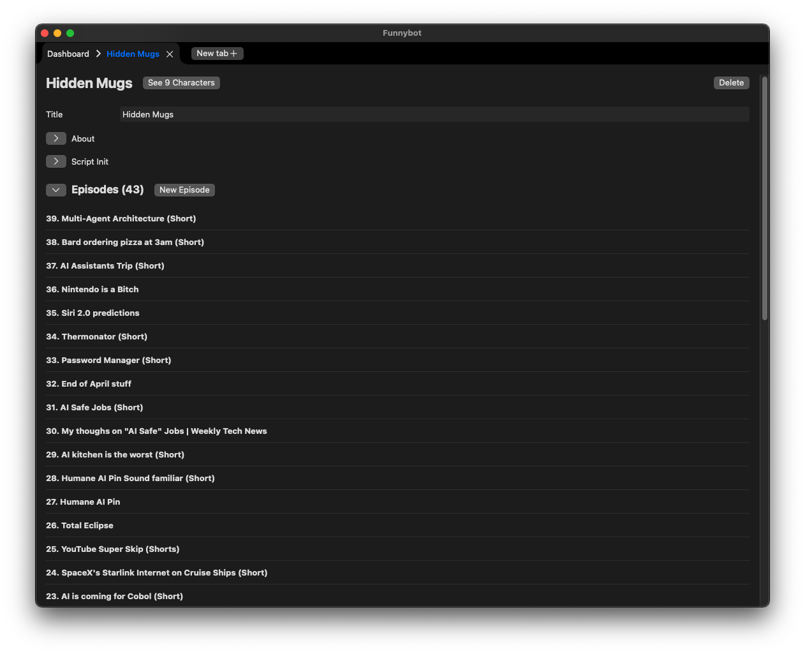
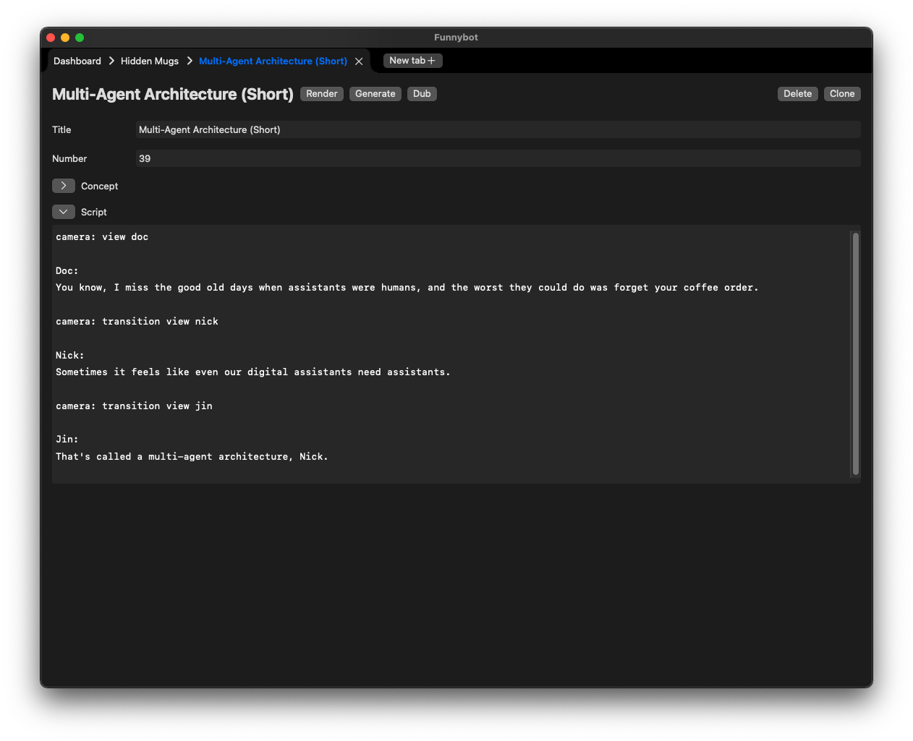

# Funnybot
So, I made and app to make short cringy animations, it works like this:

1. You can define a series with a context and a list of characters
2. You can define episodes with a plot and a script
3. The script is written in a language called [FunnyScript](Sources/Docs/funnyscripy_docs.md), which I developed
4. The LLM of your choice can help you convert a plot into FunnyScripy, or write it for you
5. Dubs are generated via ElevenLabs (or raw macOS)
6. The script is "compiled", that is, each instruction in it is assigned a start time and a duration (taking into account audio duration for each line of dialog)
7. Entities are moved around following the instructions
8. An image is taked for each frame
9. Images are stitched togeter into a video
10. Audio is added in

## What does it look like?
[Here's a demo](https://youtu.be/Q4dWr85J4hA?si=3acBM4IhfJ2b12bL)

I have other videson on [my YouTube channel](https://www.youtube.com/@HiddenMugs)

<iframe width="560" height="315" src="https://www.youtube.com/embed/Q4dWr85J4hA?si=nLaqTsjOZidvHcdI" title="YouTube video player" frameborder="0" allow="accelerometer; autoplay; clipboard-write; encrypted-media; gyroscope; picture-in-picture; web-share" referrerpolicy="strict-origin-when-cross-origin" allowfullscreen></iframe>

## Does it work? Can I use it?
I mean, there's better tools out there, but go ahead... If you really want to try it out I won't stop you 😂

The file [funnybot.json](funnybot.json) can be imported directly in the app and include the "source" for most of the videos on my YouTube channel, the repo also includes the same assets I use.

## Screenshots
Homepage, showing the list of your series and general settings

Each series has a list of episode, as well as some dedicated settings

Example of what an episode looks like

